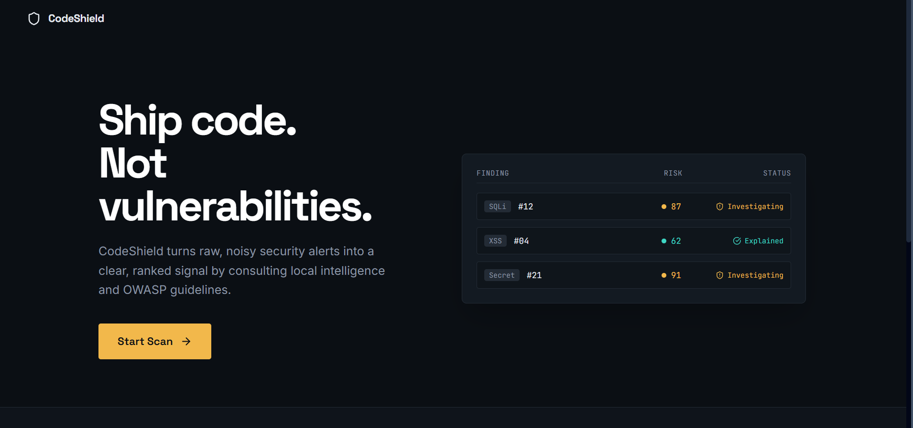
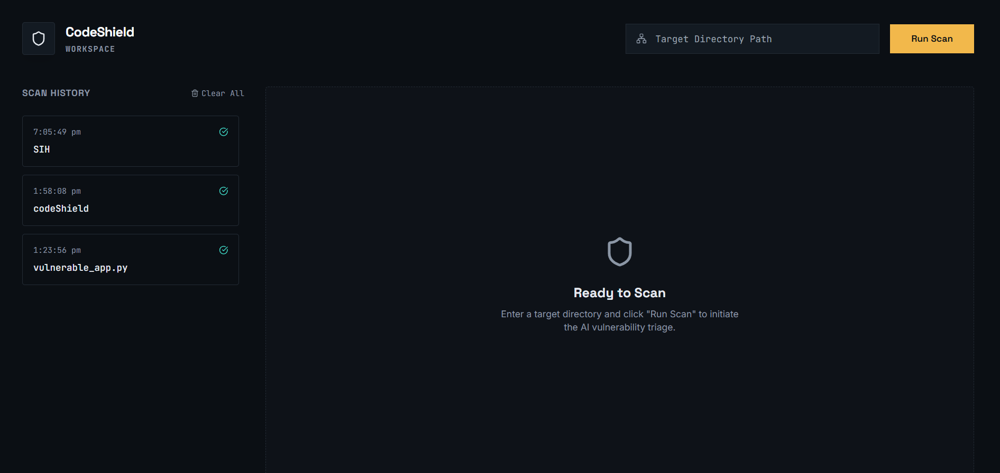
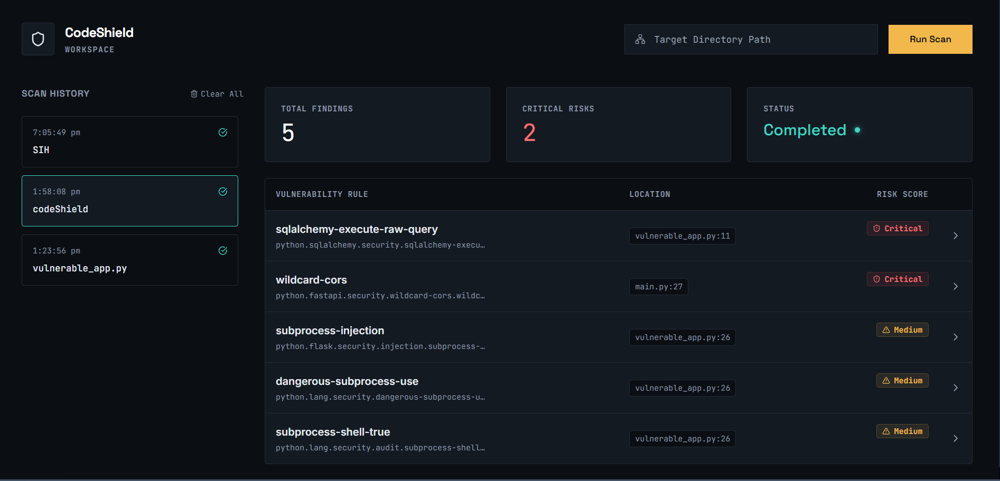
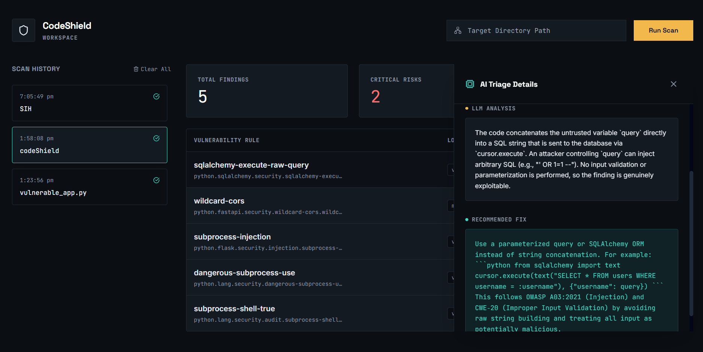

# CodeShield 🛡️

CodeShield is a local-first, AI-driven security triage tool designed to eliminate alert fatigue from static analysis scanners. 

Static analyzers (like Semgrep) are incredibly fast at finding *potential* vulnerabilities but lack the context to determine if a vulnerability is *actually exploitable*. CodeShield acts as an AI security analyst on top of Semgrep, applying a multi-stage triage pipeline to drastically reduce false positives.

## 🚀 Features

- **Context-Aware AI Analysis**: Uses a local LLM to reason about exploitability based on surrounding code context.
- **GitHub Repository Scanning**: Paste any GitHub URL (public or private) to instantly clone, scan, and securely clean up the codebase.
- **RAG-Backed Security Guidelines**: Queries a local `ChromaDB` vector database containing OWASP Top 10 and CWE documentation to ground the analysis in vetted security standards.
- **High-Performance Architecture**: 
  - **Parallel Execution**: Uses concurrent thread pooling to process multiple vulnerabilities simultaneously, dramatically reducing scan time.
  - **Threshold Filtering**: Intelligently bypasses LLM inference for low-risk findings to preserve compute resources.
  - **Hybrid Persistent Caching**: Out-of-the-box SHA-256 fingerprint caching using SQLite to prevent duplicate LLM calls across rescans, with automatic fallback to **Redis** for distributed, ultra-fast caching in production.
- **Modern Glassmorphism UI**: A beautifully crafted React dashboard that sorts findings by dynamic Risk Scores instead of raw JSON.

---

## 📸 Screenshots

*(Attach screenshots of the application below)*

- **Landing Page**: 
  

- **Dashboard**:
  

- **Scan Page**:
  

- **Vulnerability Explanation**:
  

---

## 🧠 Architecture

The system is decoupled into a high-performance backend and a modern frontend client:

**Backend (FastAPI)**
- **Static Analysis**: Semgrep CLI
- **LLM Engine**: Local Ollama (e.g., Llama 3) with a graceful failover to the Groq API.
- **Vector Database**: ChromaDB + `sentence-transformers` (`all-MiniLM-L6-v2`)
- **Database / Caching**: SQLAlchemy, SQLite, Redis

**Frontend (React/Vite)**
- **Styling**: Tailwind CSS (Semantic Design Tokens)
- **Icons**: Lucide React
- **Architecture**: Client-side animated hero previews with polling-based dashboard data fetching.

---

## 🛠️ Setup & Installation

### Prerequisites
1. **Python 3.10+**
2. **Node.js 18+**
3. **Semgrep** (`pip install semgrep`)
4. *(Optional)* **Ollama**: Install [Ollama](https://ollama.com/) and pull a model (e.g., `ollama run llama3.1`). If you skip this, just provide a Groq API key in your `.env`.

### 1. Start the Backend API
```bash
cd backend
# Create and activate virtual environment
python -m venv venv
# Windows: .\venv\Scripts\activate | Mac/Linux: source venv/bin/activate

# Install dependencies
pip install fastapi uvicorn sqlalchemy requests pydantic chromadb sentence-transformers python-dotenv redis

# Build the RAG Corpus (only needed once)
python rag/indexer.py

# Set your Groq API key (if not using local Ollama)
# Edit backend/.env and add: GROQ_API_KEY=your_key_here

# Start the FastAPI server
uvicorn app.main:app --host localhost --port 8000
```

### 2. Start the Frontend Dashboard
```bash
cd frontend
npm install
npm run dev
```

Open your browser to `http://localhost:5173`. Enter the absolute path to a local repository and click **Run Scan**!
